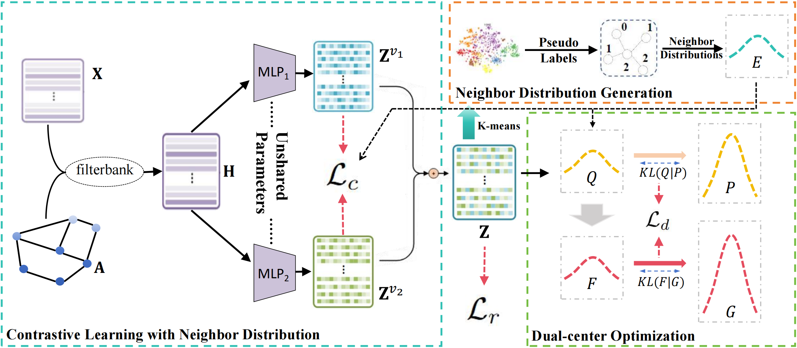

# DCGC
An official source code for paper Dual-Center Graph Clustering with Neighbor Distribution

-------------

### Overview

<p align = "justify"> 
Graph clustering is crucial for unraveling intricate data structures, yet it presents significant challenges due to its unsupervised nature. Recently, goal-directed clustering techniques have yielded impressive results, with contrastive learning methods leveraging pseudo-label garnering considerable attention. Nonetheless, pseudo-label as a supervision signal is unreliable and existing goal-directed approaches utilize only features to construct a single-target distribution for single-center optimization, which lead to incomplete and less dependable guidance. In our work, we propose a novel Dual-Center Graph Clustering (DCGC) approach with neighbor distribution properties, which includes representation learning with neighbor distribution and dual-center optimization. Specifically, we utilize neighbor distribution as a supervision signal to mine hard negative samples in contrastive learning, which is reliable and enhances the capability of representation learning. Furthermore, neighbor distribution center is introduced alongside feature center to jointly construct a dual-target distribution for dual-center optimization. Extensive experiments and analysis demonstrate the superior performance and effectiveness of our proposed method.
<div  align="center">    
    
</div>


<div  align="center">    
      Figure 1: Illustration of our proposed dual-center graph clustering approach (DCGC).
</div>

### Requirements

The proposed DCGC is implemented with python 3.7 on an NVIDIA A100 tensor core GPU. 

Python package information is summarized in **requirements.txt**:

- torch==1.7.1
- tqdm==4.59.0
- numpy==1.21.5
- munkres==1.1.4
- scikit-learn==1.0.2


### Quick Start

- Step1: use the **cora.zip** file or other datasets 

- Step2: unzip the dataset into the **./dataset** folder

- Step3: use "mkdir pretrain" to create **./pretrain** folder

- Step4: run

  ```
  python train.py
  ```

  the clustering results will be recorded in the **./results.csv** file
